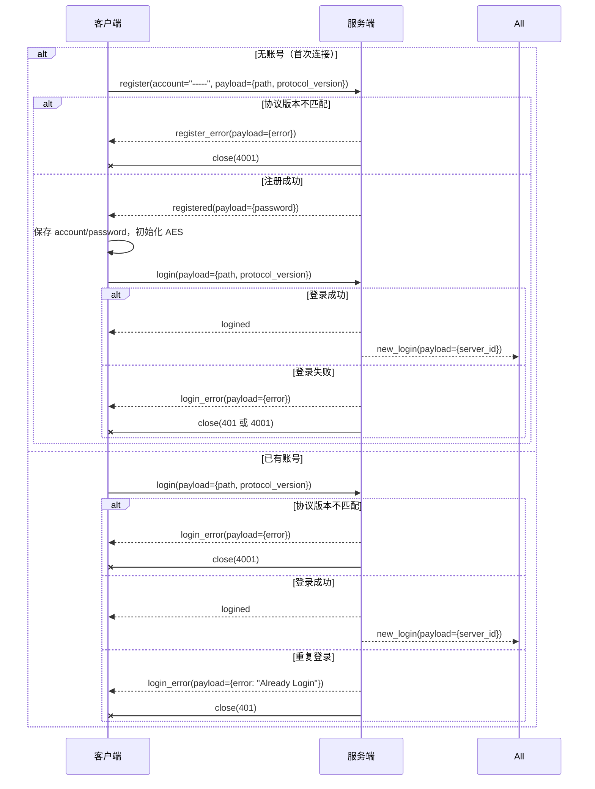

# WebSocket 协议与数据流

本文档描述 `Project-Refactoring-Codespace` 当前版本使用的 WebSocket 通讯协议、数据包结构与典型流程。

> 与旧版 `ConnectCore/doc/websocket.md` 相比，当前实现已经改为：
>
> - 使用 **字符串枚举** 表示数据包类型
> - 使用 `pydantic` 数据模型 `DataModel`
> - 支持 `status_registry` 注册自定义状态
> - 客户端注册 / 登录会附带 `PROTOCOL_VERSION`
> - 提供最近数据包与历史数据包查询能力

---

## 连接层报文包装

真正通过 WebSocket 发送的外层消息格式如下：

```python
{
    "account": "server_id_or_-----",
    "data": "<AES encrypted json string>"
}
```

说明：

- `account == "-----"`：表示尚未完成注册 / 登录的临时身份
- `data`：AES 加密后的 JSON 字符串
- 注册阶段使用临时密钥
- 已登录阶段使用账号对应的密码进行加解密

---

## 逻辑数据包结构

解密后的业务数据使用 `DataModel` 表示：

```python
{
    "type": "data_send",
    "status": null,
    "sid": 12,
    "to": ["target_server", "target_plugin"],
    "from": ["source_server", "source_plugin"],
    "payload": {
        "message": "hello"
    },
    "timestamp": 1710000000.0,
    "checksum": "md5_of_payload"
}
```

### 字段含义

- `type`: 数据包类型，类型见下表
- `status`: 可选状态字符串；内置状态见 `PacketStatus`，也支持自定义字符串
- `sid`: 数据包序号，用于历史重放、确认和恢复
- `to`: 目标 `(server_id, plugin_id)`
- `from`: 来源 `(server_id, plugin_id)`
- `payload`: 业务数据体
- `timestamp`: 发送时间戳
- `checksum`: 数据完整性校验值；若有 `payload` 且未显式给出，会自动计算

### 保留目标值

- `("-----", "-----")`：临时目标 / 注册阶段
- `("-----", "system")`：服务端系统身份
- `("all", "system")`：广播目标

---

## 内置数据包类型

| PacketType | 用途 |
| --- | --- |
| `test_connect` | 测试连接 / 非法握手反馈 |
| `ping` | 心跳检测 |
| `pong` | 心跳响应 |
| `control_stop` | 控制：停止 |
| `control_reload` | 控制：重载 |
| `control_maintenance` | 控制：维护模式 |
| `control_resume` | 控制：恢复 |
| `register` | 客户端申请注册 |
| `registered` | 服务端下发注册结果 |
| `register_error` | 注册失败 |
| `login` | 客户端申请登录 |
| `logined` | 登录成功 |
| `new_login` | 广播：有新服务器上线 |
| `del_login` | 广播：有服务器下线 |
| `login_error` | 登录失败 |
| `data_send` | 发送业务数据 |
| `data_sendok` | 数据接收确认 |
| `data_error` | 数据校验失败 / 请求重发 |
| `file_send` | 文件头 |
| `file_sending` | 文件分片 |
| `file_sendok` | 文件尾 / 完成确认 |
| `file_error` | 文件传输失败 |

---

## 内置状态值

`PacketStatus` 提供了一组推荐状态：

- `request`
- `ok`
- `error`
- `sending`
- `new`
- `del`
- `stop`
- `reload`
- `maintenance`
- `resume`

但当前实现中，`status` 字段并不限制死为这些值。插件可以注册并使用自己的状态，例如：

```python
from connect_core.api import PacketType, status_registry

status_registry.register_status(PacketType.DATA_SEND, "example.notify")
```

---

## 协议版本

当前协议版本常量为：

```python
PROTOCOL_VERSION = 1
```

客户端在以下流程中会携带版本号：

- `register`
- `login`

服务端收到后会校验客户端版本是否等于服务端版本：

- 一致：继续流程
- 不一致：返回 `register_error` 或 `login_error`
- 随后关闭连接，关闭码为 `4001`

---

## 注册与登录流程

下面的时序图对应当前 PRC 实现，逻辑上与旧文档附图一致，但字段形式已更新。


```mermaid
sequenceDiagram
    participant C as 客户端
    participant S as 服务端

    alt 无账号（首次连接）
        C->>S: register(account="-----", payload={path, protocol_version})
        alt 协议版本不匹配
            S-->>C: register_error(payload={error})
            S-xC: close(4001)
        else 注册成功
            S-->>C: registered(payload={password})
            C->>C: 保存 account/password，初始化 AES
            C->>S: login(payload={path, protocol_version})
            alt 登录成功
                S-->>C: logined
                S-->>All: new_login(payload={server_id})
            else 登录失败
                S-->>C: login_error(payload={error})
                S-xC: close(401 或 4001)
            end
        end
    else 已有账号
        C->>S: login(payload={path, protocol_version})
        alt 协议版本不匹配
            S-->>C: login_error(payload={error})
            S-xC: close(4001)
        else 登录成功
            S-->>C: logined
            S-->>All: new_login(payload={server_id})
        else 重复登录
            S-->>C: login_error(payload={error: "Already Login"})
            S-xC: close(401)
        end
    end
```

### 关键点

- 注册成功后客户端会把服务端分配的 `account/password` 写回配置
- `logined` 到达后客户端开始 keepalive
- `new_login` / `del_login` 会更新客户端可见服务器列表

---

## 心跳与恢复

### 服务端

- WebSocket 库原生 `ping_interval = 20`
- WebSocket 库原生 `ping_timeout = 20`
- 额外每 `20s` 主动向所有子服务器发送 websocket ping
- 若超时，服务端会关闭连接并广播 `del_login`

### 客户端

- 登录成功后启动后台 keepalive 任务
- 每轮会：
  1. 若有上次未确认的数据包，则尝试重发
  2. 若已经拿到 `server_id`，发送 `ping`

### `ping` / `pong` 的特殊行为

- `ping` 不消耗新的业务 `sid`
- 服务端会根据客户端带来的 `sid` 补发历史数据包
- `pong` 返回时会附带当前已知最大 `sid`

这套机制用于处理网络抖动、临时断线以及客户端漏收历史包的场景。

---

## 历史包与最近数据包

### 服务端

服务端会按目标服务器维护历史包，用于：

- 断线补发
- 最近数据包查询
- ACK / 重发管理

可通过：

- `CoreControlInterface.get_history_data_packet(server_id)`
- `CoreControlInterface.get_recent_packets(limit=20, server_id=None)`

获取数据。

### 客户端

客户端会维护：

- 最近发送 / 接收的数据包
- 最后已发送 SID
- 最后已接收 SID
- 最近数据包缓存（默认保留最后 100 条）

额外还提供调试能力：

- `set_sid_state(next_sid=None, last_received=None)`
- `delete_recent_sids(count)`

这些调试接口目前定义在 `connect_core.websockets.client`，主要供 CLI 调试命令使用。

---

## 数据发送流程

### 普通数据

1. 发送方构造 `data_send`
2. 接收方校验 `checksum`
3. 校验通过：触发目标插件的 `recv_data(from_server_id, data)`
4. 回发 `data_sendok`
5. 若校验失败：回发 `data_error`
6. 发送方收到 `data_error` 后重发最后一个数据包

### 广播数据

当目标服务器为 `all` 时：

- 服务端会为每个目标服务器生成对应 SID
- 将包广播给所有在线子服务器
- 可排除指定服务器 ID

---

## 文件发送流程

当前文件发送分为三段：

1. `file_send`
   - 携带 `file_name`
   - 携带 `save_path`
   - 携带整文件哈希 `hash`

2. `file_sending`
   - 携带每个分片的十六进制字符串
   - 分片大小默认为 **1 MiB**

3. `file_sendok`
   - 发送结束确认
   - 再次携带 `file_name`、`save_path`、`hash`

接收方在最后会验证文件哈希；成功后触发：

```python
recv_file(from_server_id, file_path)
```

若任意阶段校验失败，则发送 `file_error`。

---

## 自定义状态与扩展处理器

PRC 重构版新增了协议扩展点：`StatusRegistry`。

### 注册方式

```python
from connect_core.api import PacketType, status_registry


async def handle_custom(packet):
    print(packet.type, packet.status, packet.payload)

status_registry.register_status(PacketType.DATA_SEND, "example.custom")
status_registry.register_handler(PacketType.DATA_SEND, "example.custom", handle_custom)
```

### 触发方式

当内置分支没有接管某个包时：

- 服务端 / 客户端都会尝试在 `status_registry` 中查找处理器
- 若回调返回协程对象，会自动 `await`
- 若没有匹配处理器，则只打印调试日志，不会强制报错

这意味着第三方插件可以在不修改 ConnectCore 内核的前提下扩展协议行为。

---

## 与旧版文档的主要差异

旧版文档中的以下描述在 PRC 当前实现中已发生变化：

1. **数据包结构不再使用嵌套的 `data.payload / data.timestamp / data.checksum`**
   - 当前改为顶层字段：`payload`、`timestamp`、`checksum`

2. **`type` / `status` 不再使用数字元组**
   - 当前使用字符串枚举和可扩展状态字符串

3. **增加协议版本校验**
   - 注册与登录都要带 `protocol_version`

4. **增加最近数据包 / 历史重放能力**
   - 不只是“发了就算”，而是可恢复、可观测

5. **支持自定义状态与处理器注册**
   - 协议扩展不再需要直接改核心分发表

---

## 调试建议

如果你在调试协议问题，建议优先关注：

- `type`
- `status`
- `sid`
- `to` / `from`
- `payload`
- `checksum`
- 客户端发送的 `protocol_version`

同时可以结合 CLI 中的最近数据包查看命令，快速确认：

- 包有没有发出去
- 包有没有收到 ACK
- 是否发生了重发
- 是否因为 SID 断层触发历史补发
