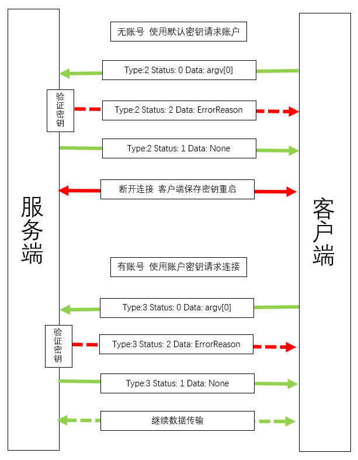

# 数据包格式

```python
{
    "s": sID,                               # 数据包编号，确认数据发送正确
    "type": ("TYPE", "STATUS"),             # 数据包类型标识符，定义见下文。
    "to": ("SERVER_ID", "PLUGIN_ID"),       # 数据包目标
    "from": ("SERVER_ID", "PLUGIN_ID"),     # 数据包来源
    "data": {
        "payload": Data,                    # 数据载荷，内容根据数据包类型变化。
        "timestamp": Timestamp,             # 时间戳，用于标识数据发送的时间。
        "checksum": Checksum                # 数据校验和，用于验证数据完整性。
    }
}
```

## 数据包类型及状态定义

### [-1] Test 数据包

- `status`:
  - `[0] Test` - 测试连接。

### [0] Basic 数据包

- `status`:
  - `[0] Ping` - Ping数据包。
  - `[1] Pong` - Pong数据包。

### [1] Control 数据包

- `Status`:
  - `[0] Stop` - 请求关闭连接或停止服务。
  - `[1] Reload` - 请求重载服务配置或模块。
  - `[2] Maintenance` - 进入维护状态，部分服务受限。
  - `[3] Resume` - 从维护状态恢复到正常服务。

### [2] Register 数据包

- `Status`:
  - `[0] Register` - 客户端请求注册操作。
  - `[1] FinishRegister` - 服务器确认完成注册。
  - `[2] RegisterError` - 注册失败，提供错误详情。

### [3] Login 数据包

- `Status`:
  - `[0] Login` - 客户端请求登录操作。
  - `[1] FinishLogin` - 服务器确认完成登录。
  - `[2] NewLogin` - 服务器有新的登录。
  - `[3] DelLogin` - 服务器有新的登出。
  - `[4] LoginError` - 登录失败，提供错误详情。

### [4] Data 数据包

- `Status`:
  - `[0] Send` - 请求发送数据。
  - `[1] SendOK` - 确认接收数据。
  - `[2] DataError` - 数据传输失败，提供错误详情。

### [5] File 数据包

- `Status`:
  - `[0] Send` - 请求发送文件。
  - `[1] Sending` - 正在发送文件。
  - `[2] SendOK` - 确认接收文件。
  - `[3] FileError` - 文件传输失败，提供错误详情。

## 数据包流程


